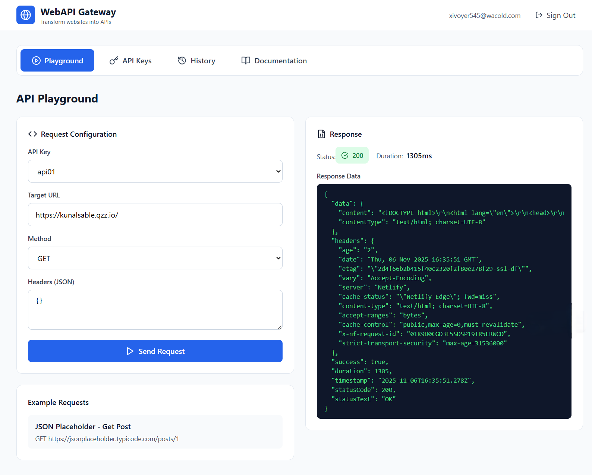

# APIfy - API Playground for Any Website

[](https://apify.bolt.host/)

[](https://apify.bolt.host/)


APIfy is a powerful web application that allows you to interact with and test APIs from any website. Built with modern web technologies, it provides an intuitive interface for managing API keys, testing endpoints, and exploring API documentation.

## 🚀 Features

- **Authentication System**: Secure user authentication powered by Supabase
- **API Key Management**: Easily store and manage your API keys
- **API Playground**: Interactive environment to test API endpoints
- **Request History**: Track and review your API requests
- **Documentation Viewer**: Access and explore API documentation
- **Web Scraping**: Built-in web scraping capabilities via Supabase Edge Functions
- **Responsive Design**: Modern UI built with Tailwind CSS

## 🛠️ Tech Stack

- **Frontend**: React 18, TypeScript, Vite
- **Styling**: Tailwind CSS
- **Backend**: Supabase (Database, Auth, Edge Functions)
- **Icons**: Lucide React
- **Build Tool**: Vite
- **Linting**: ESLint

## 📦 Installation

1. **Clone the repository**
   ```bash
   git clone https://github.com/ghostshanky/apify.git
   cd apify
   ```

2. **Install dependencies**
   ```bash
   npm install
   ```

3. **Set up environment variables**
   Create a `.env` file in the root directory and add your Supabase configuration:
   ```env
   VITE_SUPABASE_URL=your_supabase_url
   VITE_SUPABASE_ANON_KEY=your_supabase_anon_key
   ```

4. **Start the development server**
   ```bash
   npm run dev
   ```

5. **Build for production**
   ```bash
   npm run build
   npm run preview
   ```

## 🎯 Usage

1. Visit the live demo at [https://apify.bolt.host/](https://apify.bolt.host/)
2. Sign up or log in to your account
3. Generate API keys in the API Key Manager
4. Use the API Playground to test endpoints
5. View your request history and documentation

## 🏗️ Project Structure

```
apify/
├── src/
│   ├── components/
│   │   ├── ApiKeyManager.tsx
│   │   ├── ApiPlayground.tsx
│   │   ├── Auth.tsx
│   │   ├── Dashboard.tsx
│   │   ├── Documentation.tsx
│   │   └── RequestHistory.tsx
│   ├── contexts/
│   │   └── AuthContext.tsx
│   ├── lib/
│   │   └── supabase.ts
│   └── ...
├── supabase/
│   ├── functions/
│   │   └── web-scraper/
│   └── migrations/
├── package.json
└── README.md
```

## 🤝 Contributing

Contributions are welcome! Please feel free to submit a Pull Request.

1. Fork the project
2. Create your feature branch (`git checkout -b feature/AmazingFeature`)
3. Commit your changes (`git commit -m 'Add some AmazingFeature'`)
4. Push to the branch (`git push origin feature/AmazingFeature`)
5. Open a Pull Request

## 📄 License

This project is licensed under the MIT License - see the [LICENSE](LICENSE) file for details.

## 📞 Contact

If you have any questions or suggestions, feel free to open an issue on GitHub.

---

**Live Demo**: [https://apify.bolt.host/](https://apify.bolt.host/)
